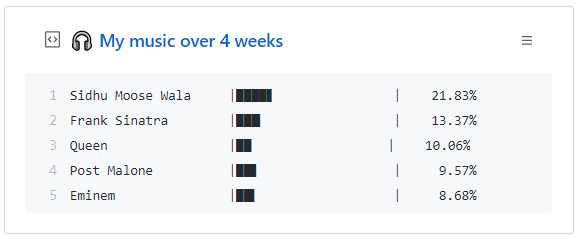

# Spotify Gist

## About repo

This repo contains necessary script for updating the GitHub Gist with your top Spotify artists over 4 weeks. Inspired by the profile of [Jack](https://github.com/jacc). Look at his profile, he's got an awesome pin collection on his profile.



Desi at Heart ❤️(Moosewala on top)

## Usage

1. Clone the repository

    ```bash
    git clone https://github.com/AtomicLemon/SpotifyGist
    cd SpotifyGist
    ```
2. Install all the dependencies

    ```bash
    pip3 install -r requirements
    ```
3. You might want to set up a cronjob for the script to run once a day or sumfing like that 🤷


Update ```credentials.py```. Generate new token for Gist privileges from Settings->Developer Options.

Update ```driver.py```. Change the username to your own username.

Example `credentials.py`:

```
CLIENT_ID = "yourspotifyappclientid"
CLIENT_SECRET = "yourspotifyappclientsecret"
TOKEN = "yourgithubtokennn"
GIST_ID = "07ed52ea6f9fc5b601b05aba849cb9eb"
```

Get spotify API keys here: https://developer.spotify.com/

Example CronTab:
```
0 0 * * * python3 /home/myuser/SpotifyGist/update.py
```
